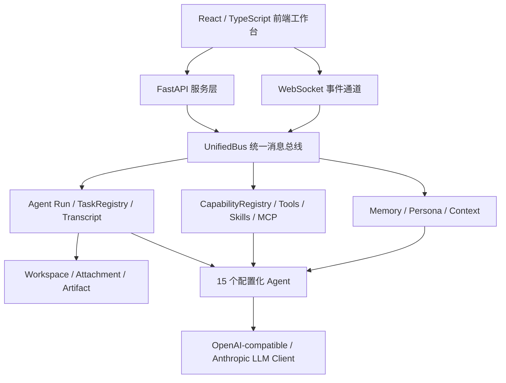
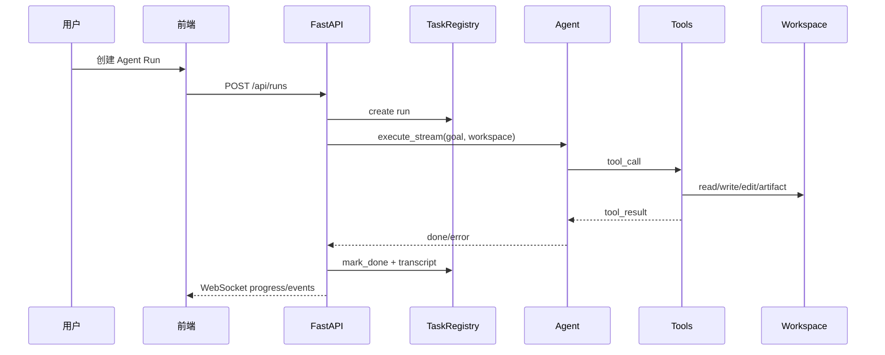

# 系统架构

> 最后更新: 2026-06-02
> 当前主线: Agent Run 多实例调度 + Project 工作区 + 能力库 + 聊天室原生协作团队。固定 Pipeline / YAML 模板编排已从生产路径移除。

## 架构总览



## 前端工作台

前端保持 React 18 + TypeScript + Vite + 原生 CSS，不引入重量级 UI 框架。当前 UI 由工作台页面组成：

- `OverviewPanel`：后端健康、实时通道、最近运行和系统概览。
- `ChatPanel`：单 Agent 会话、附件、Markdown、工作区绑定和工具/产物展示。
- `ChatroomPanel`：多 Agent 聊天室、host、目标、Todo、@ 成员接力和协作调度。
- `WorkspacePanel`：zip 导入、工作区列表、文件树、文本读取和编辑。
- `AgentPanel`：Agent 配置、模型、Tools、Skills、MCP、默认工作区、token budget、系统提示词。
- `RunsPanel`：创建 Agent Run、筛选列表、查看 Process View、raw events、artifacts、output 和取消运行。
- `MonitorPanel`：按 Agent 聚合活跃运行和实时事件流。
- `MemoryPanel`：记忆统计、搜索、创建、编辑、删除、巩固、遗忘和设置。
- `ToolsPanel`、`SkillsPanel`、`McpPanel`：能力库浏览、装配和卸下。
- `PersonaPanel`：人格定义、归档/恢复、绑定、版本历史和建议审核。
- `LoginPage`：可选全局访问密码门禁。
- `Topbar`：当前页面标题、工作区选择器和实时通道状态。

旧 `TaskPanel` 和旧 `EvolutionPanel` 已删除；运行入口是 `RunsPanel`，能力入口拆为 Tools / Skills / MCP。

## FastAPI 服务层

后端由 `backend/src/api/main.py` 初始化，路由拆在 `backend/src/api/routes/`：

- `tasks.py`：`/api/tasks` 兼容入口与 `/api/runs` Agent Run API。
- `agents.py`：Agent 列表、配置视图、创建、更新、删除、invoke、persona binding、MCP 导入。
- `catalog.py`：Tools / Skills / MCP 能力库装配与卸下。
- `workspaces.py`：Project 工作区导入、详情、文件树、文本读写。
- `chatrooms.py`：聊天室 CRUD、消息、invoke、取消。
- `chat_sessions.py`：会话和会话消息。
- `attachments.py`：附件上传、读取、删除。
- `artifacts.py`：Artifact 列表、创建、预览、下载、打开、删除。
- `memory.py`：记忆统计、搜索、创建、更新、删除、设置、巩固和遗忘。
- `personas.py`：人格定义、版本、建议、审批和兼容绑定入口。
- `config.py`：配置读取、更新、模型列表、健康检查。
- `evolution.py`：系统状态、进化指令、Tool prompt 和动态 Tool 兼容接口。

可选 `AuthMiddleware` 在 `server.access_password` 非空时保护 `/api/*`，健康检查和 Swagger 文档豁免。

## UnifiedBus

`backend/src/core/bus/unified_bus.py` 是系统通信中枢，支持：

| 模式 | 能力 |
|------|------|
| 发布/订阅 | Agent 进度、监控事件和系统事件广播 |
| 请求/响应 | 一对一请求语义 |
| 点对点路由 | MessageRouter 支持通配路由 |
| 广播 | WebSocket 和监控桥接 |
| 指标与历史 | 优先级队列、消息历史、BusMetrics |

## Agent Run 调度

当前生产运行模型是 Agent Run：

```python
RunInstance = {
    "run_id": "...",
    "task_id": "...",
    "agent_name": "coder",
    "session_id": "...",
    "workspace_id": "...",
    "goal": "...",
    "mode": "autonomous",
    "strategy": "agent_decides",
    "status": "running|completed|failed|killed",
    "progress": {...},
    "output": {...},
}
```

调度层职责：

- 创建运行实例并写入 `TaskRegistry`。
- 解析可信工作区根目录并通过 ContextVar 注入文件工具。
- 写 transcript JSONL。
- 广播 `agent_run_started`、`agent_run_event`、`agent_run_completed`、`agent_progress` 等事件。
- 处理取消、暂停、恢复等控制请求。

Agent 自己通过 LLM tool-use loop 决定下一步，不再由调度层固定 plan/code/review。

## Agent 系统

Agent 由 `config/agents.yaml` 配置生成，当前共有 15 个：

| 分组 | Agent |
|------|-------|
| 核心协作 | `assistant`、`planner`、`coder`、`reviewer` |
| 系统进化与管理 | `tool_creator`、`agent_creator`、`agent_manager`、`persona_evolution` |
| 聊天室团队 | `facilitator`、`chat_planner`、`chat_coder`、`chat_reviewer`、`researcher`、`critic`、`scribe` |

每个 Agent 可配置：

- system prompt、output format、max iterations、token budget。
- LLM/provider/model 参数。
- Tools、Agent-as-Tool。
- Skills。
- MCP servers。
- 默认工作区。

## 能力层

能力层由以下来源合成：

- `config/capabilities.yaml` 中的 22 个能力配置。
- Python `CapabilityBase` 实现。
- Agent-as-Tool 包装。
- 动态 Tool 配置。
- Agent-scoped MCP adapter 代理工具。

重要工具包括 `file_search`、`read_file`、`write_file`、`edit_file`、`bash`、`create_frontend_artifact`、`read_agent_config`、`validate_agent_config_patch`、`update_agent_config`、`requirement_checklist` 等。`bash` 默认关闭。

## Skills 与 MCP

仓库 `skills/` 下内置 12 个 Skill，包括调试、TDD、验收、前端设计、MCP 构建、PDF/DOCX、计划编写、代码审查等。核心 Agent 已挂载推荐工程纪律 Skill。

MCP 不再是全局散配置，而是 Agent-scoped：

- `config/mcp_servers.yaml` 提供 filesystem、git、fetch、sqlite 模板，默认 `enabled=false`。
- Agent 配置可挂载 MCP server。
- 运行态 adapter 为启用的 stdio server 注册 Agent 作用域代理工具。
- 状态可解释为 `configured_pending_runtime`、`proxy_available`、`partial`、`adapter_unavailable` 等。

## 工作区、附件与 Artifact

工作区解析优先级：

1. 请求显式 `workspace_id`
2. 会话绑定工作区
3. Agent `default_workspace_id`
4. Agent `default_workspace_root`
5. 自动 `workspace/runs/run-*`

Project 工作区通过 zip 导入，落在 `workspace/projects/{workspace_id}/`，并写 `.agentic-workspace.json` manifest。会话无绑定时自动获得 `workspace/sessions/{session_id}/`。

附件上传后可 materialize 到工作区 `.attachments/` 下供 Agent 读取。Artifact 默认落在 `workspace/artifacts/`，用于前端预览、下载和 inline 打开生成结果。

## 记忆与人格

记忆系统默认 ChromaDB，缺依赖时可降级 InMemory。支持：

- 自动对话反思。
- `canonical_summary` / `assistant_context` 双摘要。
- 检索评分解释。
- 近似去重、巩固、遗忘。

记忆注入必须标为不可信资料。人格系统支持定义、版本、归档、恢复、回滚、绑定和 pending 迭代建议；新 UI 的人格绑定优先走 `/api/agents/persona-bindings*`。

## 启动流程

```text
lifespan()
  -> load_config / load_yaml_configs
  -> Auth/CORS/route setup
  -> bus.start
  -> ContextStore
  -> CapabilityRegistry
  -> memory system
  -> load agents from config/agents.yaml
  -> TaskRegistry / transcript
  -> WebSocket monitor bridge
```

## 运行数据流



## 配置优先级

1. `config/*.yaml`
2. `backend/src/config.yaml`
3. 环境变量

关键环境变量包括 `LLM_PROVIDER`、`LLM_API_KEY`、`LLM_MODEL`、`LLM_BASE_URL`、`MEMORY_BACKEND`、`AGENTIC_WORKSPACE_ROOT`、`ENABLE_SHELL_TOOL` 等。

## 文档同步原则

架构变动应同步：

- `README.md`
- `QUICKSTART.md`
- `HANDOFF.md`
- `AGENTS.md`
- `docs/api.md`
- `docs/architecture.md`

不要沿用旧口径：4 个 Agent、9 个面板、TaskPanel、EvolutionPanel、固定 Pipeline、一键 Demo、MCP 仅预留接口。
