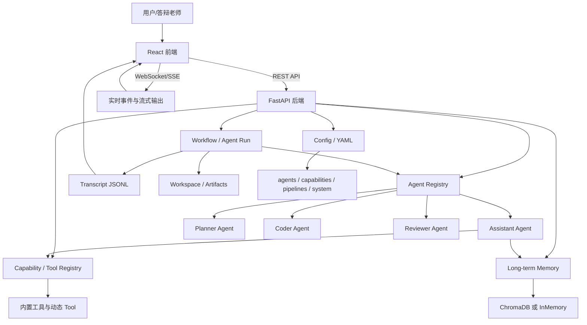
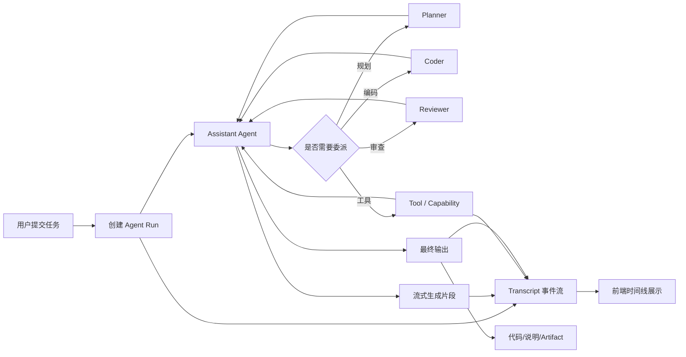
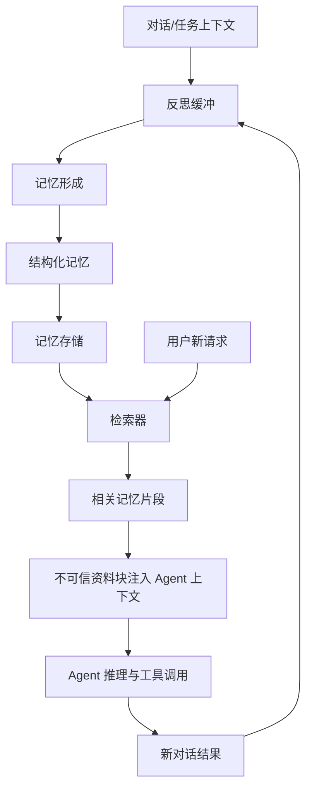
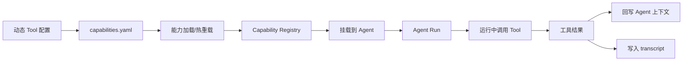
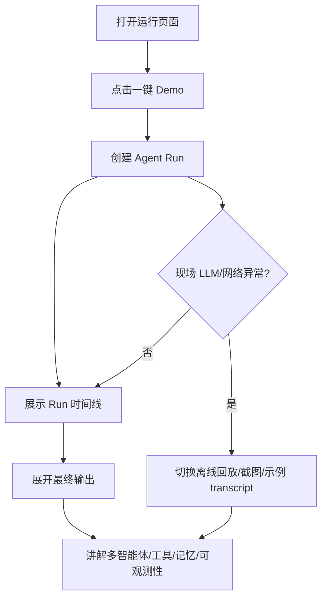

# 毕设答辩材料：Agentic System

> 用途：论文插图、答辩 PPT 结构图、现场演示讲稿。本文档只描述当前系统已实现的演示链路，不引入新的业务假设。

## 1. 项目定位

本项目定位为一个**可进化的多智能体软件开发与个人助理系统**。

系统不是单一聊天机器人，而是一个面向软件开发任务的 Agentic 运行时：用户可以通过前端提交自然语言需求，后端创建独立 Agent Run，由主 Assistant Agent 理解任务，并按需调用 Planner、Coder、Reviewer 等子 Agent 或工具能力。运行过程中的 created、started、流式生成片段（底层事件名 thinking）、tool_call、tool_result、done、error 等事件会写入 transcript，前端以时间线形式展示，便于答辩现场说明“系统如何执行、如何调用能力、如何形成最终输出”。

项目同时包含长期记忆、动态工具配置、Agent/人格管理、YAML 配置与热重载等能力，用于展示“从固定代码生成器到可演化个人助理平台”的设计思路。

## 2. 答辩讲解主线

| 阶段 | 讲解重点 | 建议配图/页面 |
| --- | --- | --- |
| 问题背景 | 普通大模型对话难以稳定完成软件开发任务；缺少任务拆解、工具调用、过程追踪和长期上下文 | 总体架构图 |
| 系统架构 | React 前端 + FastAPI 后端 + Agent Registry + Capability Registry + Memory + Run/Transcript + YAML Config | 系统总体架构图 |
| 核心模块 | 多 Agent 协作、工具能力扩展、长期记忆、运行轨迹可观测、动态配置、人格/Agent 管理 | 模块流程图 |
| 演示流程 | 一键 Demo 创建 Run，展示时间线和最终输出 | 答辩 Demo 流程图、Run 页面 |
| 创新点 | 把 Agent、Tool、Memory、Transcript、Config 组织成可扩展运行时 | 创新点对照表 |
| 兜底方案 | LLM 或网络不可用时，展示已录制 Run、截图、示例 transcript 和材料图 | Demo 验收文档 |

## 3. 系统总体架构图

## 4. 多智能体运行流程图

## 5. 记忆系统流程图

## 6. 工具/能力扩展图

## 7. 答辩 Demo 流程图

## 8. 3 分钟讲稿

各位老师好，我的毕设题目是基于多智能体协作的自动化代码生成与审查系统。这个项目的目标不是做一个普通聊天网页，而是做一个可进化的多智能体软件开发与个人助理运行时。

背景问题是：单次大模型对话在复杂开发任务中容易缺少任务拆解、工具调用、过程记录和长期上下文。因此我把系统拆成前端、FastAPI 后端、Agent Registry、Capability Registry、长期记忆和运行轨迹 transcript 几个核心部分。用户提交一个自然语言任务后，系统创建独立 Agent Run，由 Assistant Agent 作为主控，根据任务需要委派 Planner、Coder、Reviewer，或者调用代码解析、文件、搜索、动态工具等能力。

答辩演示时，我会点击运行页面的一键 Demo，例如“小型 Flask API”。系统会创建一个 Run，前端展示 run_id、agent、workspace、状态和耗时。展开后可以看到 created、started、流式生成片段、tool_call、done 等 transcript 时间线。最后 completed 后展开最终输出，展示生成的代码和运行说明。

系统的创新点主要有六个：第一，多智能体编排，把规划、编码、审查解耦；第二，工具能力可以通过配置扩展并挂载到 Agent；第三，长期记忆可以检索并注入上下文；第四，运行过程全程可观测；第五，YAML 配置和热重载降低扩展成本；第六，支持人格与 Agent 管理，使系统更接近私人助理平台。若现场 LLM 不通，我也准备了已录制 Run、截图和示例 transcript，保证可以稳定说明系统设计与效果。

## 9. 8 分钟讲稿

各位老师好，我的毕业设计是一个可进化的多智能体软件开发与个人助理系统。它面向的问题是：普通大模型聊天虽然可以回答代码问题，但在真实开发任务中通常缺少稳定的任务拆解、工具调用、结果审查、长期记忆和过程追踪。尤其是答辩或验收时，如果系统只返回一段结果，老师很难判断系统内部做了什么、是否真的有协作流程、失败时如何定位。

因此，我把系统设计成一个 Agentic 运行时。前端使用 React，提供对话、运行、Agent 管理、记忆、进化和监控等页面。后端使用 FastAPI，核心包括 Agent Registry、Capability Registry、Memory、Agent Run、Transcript 和 YAML 配置体系。Agent Registry 管理 Assistant、Planner、Coder、Reviewer 等智能体；Capability Registry 统一管理内置工具、动态工具和 Agent-as-Tool；Memory 负责长期记忆形成、存储、检索和注入；Run/Transcript 负责把每次任务的生命周期记录下来，形成可观测的事件流。

在运行流程上，用户提交一个任务后，系统会创建独立 Agent Run。Assistant Agent 先理解需求，如果任务复杂，可以委派 Planner 做任务拆解，再委派 Coder 生成代码，必要时交给 Reviewer 审查。工具调用、模型输出片段、错误和最终结果都会写入 transcript。前端不会只展示大段 JSON，而是把事件整理成时间线，让老师能看到 created、started、流式生成片段、tool_call、tool_result、done 等阶段。

记忆系统是另一个重点。系统会把对话或任务上下文进入反思缓冲，形成结构化记忆，再写入 ChromaDB 或 InMemory 存储。新请求到来时，检索器会找出相关记忆，并以“不可信资料”的形式注入 Agent 上下文。这样既能利用长期偏好和项目背景，又不会让记忆文本覆盖系统规则。

工具扩展方面，系统支持动态 Tool 配置。工具定义写入 capabilities.yaml，加载后进入 Capability Registry，再挂载给指定 Agent。这样演示时可以说明：系统能力不是写死在一个 prompt 里，而是通过注册表和配置逐步扩展。

现场演示我会使用运行页面顶部的一键 Demo。推荐展示“小型 Flask API”，因为老师容易理解：系统收到任务后生成一个包含 /health、/todos GET、/todos POST 的 Flask API，并给出运行命令和 curl 示例。演示时我会先点击一键 Demo，说明 Run 已创建；然后展开 Run，讲解 run_id、agent、workspace、状态和耗时；接着展示 transcript 时间线，说明系统的可观测性；最后展开最终输出，展示生成代码和验收方式。

创新点可以概括为六个方面：第一，多智能体编排，把需求分析、代码生成和审查模块化；第二，工具能力扩展，通过 Capability Registry 统一调用内置工具、动态工具和 Agent；第三，长期记忆，使系统具备跨会话上下文；第四，运行轨迹可观测，便于调试和答辩展示；第五，动态配置和热重载，减少新增 Agent 或 Tool 的代码成本；第六，人格和 Agent 管理，使系统从代码生成器进一步扩展为私人助理平台。

最后是兜底方案。因为现场网络或 LLM API 可能不稳定，我准备了三层兜底：第一，使用已经完成的 Run 记录进行回放；第二，展示截图和示例 transcript；第三，直接使用本文档中的 Mermaid 架构图讲解系统设计。这样即使现场模型不可用，也能完整说明系统架构、核心模块和工程实现。

## 10. 创新点对照表

| 创新点 | 系统实现 | 答辩讲解方式 | 可展示材料 |
| --- | --- | --- | --- |
| 多智能体编排 | Assistant 作为主控，Planner/Coder/Reviewer 可作为子 Agent 或能力被调用 | 展示 Agent Run 流程，说明任务如何从需求进入规划、编码、审查 | 多智能体运行流程图、Run 时间线 |
| 工具能力扩展 | Capability Registry 统一管理内置工具、动态 Tool、Agent-as-Tool | 说明 Tool 不是写死在 prompt 中，而是可注册、可挂载、可热重载 | 工具/能力扩展图、Evolution/Agent 页面 |
| 长期记忆 | 对话/任务上下文经反思形成记忆，检索后以不可信资料注入 Agent | 说明系统能记住偏好和项目背景，同时保留安全边界 | 记忆系统流程图、Memory 页面 |
| 运行轨迹可观测 | 每个 Run 生成 transcript JSONL，前端整理为时间线 | 展示 created、started、流式生成片段、tool_call、done、error 等事件 | Run 时间线、示例 transcript |
| 动态配置/热重载 | agents/capabilities/pipelines/system 等 YAML 配置，支持运行时加载 | 说明新增 Agent/Tool 不必大改主流程 | 系统总体架构图、配置文件片段 |
| 人格/Agent 管理 | Persona 与 Agent 绑定，Agent 配置可在页面管理 | 说明系统可从固定机器人扩展到可配置私人助理 | Agent/Persona 页面截图或演示 |

## 11. 答辩兜底方案

1. **在线演示优先**：使用一键 Demo 创建新的 Agent Run，展示实时 transcript 和最终输出。
2. **半在线兜底**：如果 LLM 慢或偶发失败，展示历史已完成 Run，讲解 transcript 和最终输出。
3. **离线兜底**：如果网络或 API Key 不可用，展示已录制视频、Run 页面截图、示例 JSONL transcript。
4. **讲解兜底**：如果现场无法操作系统，使用本文档 Mermaid 图讲完整架构与数据流。
